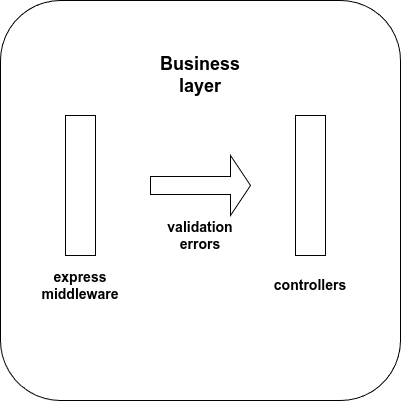
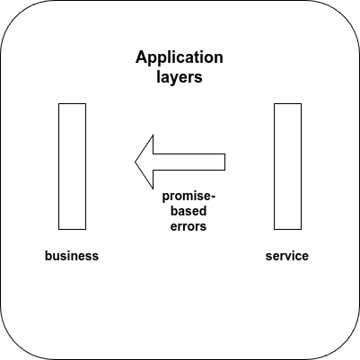

# Job Board API test plan

Document version 1.0.4

## Introduction

The Job Board API test plan contains information on tests that run during the development phase of the project.

## In Scope

The project's tests are unit and integration tests. Completed tests are noted with ✔ and any pending ones with ⌛.

## Unit tests

Unit tests are conducted per layer and can be further divided into **validation-oriented** and **promise-oriented**.

### Validation-oriented

#### Domain layer

Domain layer unit test suites:

- Application model [✔],
- Listing model [✔],
- Person model [✔],
- User model [✔].

```text
└── tests
    └── unit
        ├── application.model.test.ts
        ├── listing.model.test.ts
        ├── person.model.test.ts
        └── user.model.test.ts
```

The domain layer unit tests contain simulated scenarios, in which a stub of `validateSync()`[^1] returns specific validation errors.

### Promise-oriented

#### Persistence layer

Persistence layer unit test suites:

- Application repository [✔],
- Listing repository [✔],
- Person repository [✔],
- User repository [✔].

```text
└── tests
    └── unit
        ├── application.repository.test.ts
        ├── listing.repository.test.ts
        ├── person.repository.test.ts
        └── user.repository.test.ts
```

Depending on its particular return type, each repository function is tested against 2 scenarios:

1. **Positive scenario**: Promise resolves to an object or an array of objects.
2. **Negative scenario**: Promise resolves to null or an empty array.

#### Service layer

Service layer unit test suites:

- Application service [✔],
- Listing service [✔],
- Person service [✔],
- User service [✔].

```text
├── src
└── tests
    └── unit
        ├── application.service.test.ts
        ├── listing.service.test.ts
        ├── person.service.test.ts
        └── user.service.test.ts
```

Compared to the persistence layer unit tests, the service layer unit tests perform scenarios in which the promise:

- is rejected and,
- is resolved to null or an empty array.

The purpose of the tests is to check the behavior of the try/catch blocks as well as the triggering of errors.

## Integration tests

### Backend integration tests

Backend integration test suites:

- Application creation [✔],
- Application removal by ID [✔],
- Application retrieval by listing ID [✔],
- Application retrieval by person ID [✔],
- Application retrieval by unique index [✔],
- Listing creation [✔],
- Listing retrieval by employment type [✔],
- Listing retrieval by experience level [✔],
- Listing retrieval by ID [✔],
- Listing retrieval by status [✔],
- Listing retrieval by work type [✔],
- Listing update [✔],
- Person info creation [✔],
- Person info retrieval by username [✔],
- Person info update [✔],
- User registration [✔],
- User retrieval by email [✔],
- User retrieval by role [✔],
- User retrieval by username [✔],
- User update [✔]

```text
├── src
└── tests
    └── backendIntegration
        ├── applicationCreation.test.ts
        ├── applicationRemovalById.test.ts
        ├── applicationRetrievalByListingId.test.ts
        ├── applicationRetrievalByPersonId.test.ts
        ├── applicationRetrievalByUniqueIndex.test.ts
        ├── listingCreation.test.ts
        ├── listingRetrievalByEmploymentType.test.ts
        ├── listingRetrievalByExperienceLevel.test.ts
        ├── listingRetrievalById.test.ts
        ├── listingRetrievalByStatus.test.ts
        ├── listingRetrievalByWorkType.test.ts
        ├── listingUpdate.test.ts
        ├── personInfoCreation.test.ts
        ├── personInfoRetrievalByUsername.test.ts
        ├── personInfoUpdate.test.ts
        ├── userRegistration.test.ts
        ├── userRetrievalByEmail.test.ts
        ├── userRetrievalByRole.test.ts
        ├── userRetrievalByUsername.test.ts
        └── userUpdate.test.ts
```

Each test suite is divided into **positive** and **negative** scenarios, with the latter being further subdivided into **validation-oriented** and **promise-oriented** tests.

#### Negative and validation-oriented

The negative, validation-oriented tests trigger validation errors with specific input to check the behavior of the express-validator middleware and that of the controllers catching the errors.



#### Negative and promise-oriented

The negative, promise-oriented tests generate promise rejections, which are caught by the service layer and, then, re-thrown to the controllers of the business layer for handling.



### Auth integration tests

Auth logic integration test suites:

- Successful user login [✔],
- Failed user login [✔].

```text
├── src
└── tests
    └── authIntegration
        ├── userLoginFailure.test.ts
        └── userLoginSuccess.test.ts
```

### Database integration tests

Database integration test suites:

- Application collection [✔],
- Listing collection [✔],
- Person collection [✔],
- User collection [✔].

```text
├── src
└── tests
    └── databaseIntegration
        ├── applicationCollection.test.ts
        ├── listingCollection.test.ts
        ├── personCollection.test.ts
        └── userCollection.test.ts
```

Here, one operation per collection is tested to check database connectivity and its integration with the backend layers.

## Out of scope

The Job Board API is a backend project, therefore any tests involving the frontend are excluded.

## Assumptions

The current implementation is for demonstration purposes and might be subject to changes due to maintenance.

## Environment + Tools

- Mongoose,
- Mocha,
- Sinon,
- Chai and chai-as-promised.

[^1]: Documentation for `validateSync()` can be found in: [https://mongoosejs.com/docs/api/document.html](https://mongoosejs.com/docs/api/document.html)
